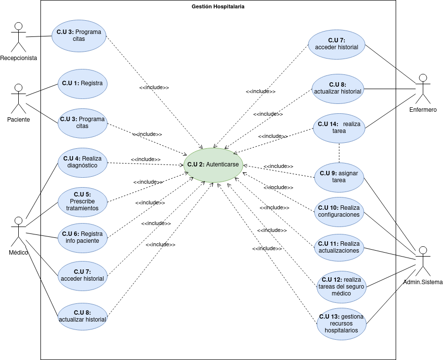

# Ruben Abreu Gonzalez
### Indice
- [Gestion Hospitalaria](#gestion-hospitalaria)
- [Diagrama](#diagrama)
- [Tabla actores](#tabla-actores)
- [Tabla casos de uso](#tabla-case-use)

## Gestion Hospitalaria
El sistema de gestión hospitalaria tiene como objetivo mejorar la eficiencia y coordinación de los procesos dentro de un hospital. En el sistema participan distantas personas, como son: Paciente, Médico, Enfermero, Administrador del Sistema y Recepcionista. A continuación, se presentan algunos casos de uso para este sistema:

La información que se posee de cada uno de ellos es la siguiente:

- Paciente: Un individuo que busca servicios médicos en el hospital.
- Médico: Profesional médico encargado de diagnosticar y tratar a los pacientes.
- Enfermero: Encargado de asistir a los médicos y cuidar a los pacientes.
- Administrador del Sistema: Responsable de la configuración y administración del sistema.
- Recepcionista: Encargado de la recepción de pacientes y asignación de citas.

Las acciones que se realizarán en el sistema son las que siguen:

- El paciente se registra en el sistema proporcionando información personal y médica.
El paciente o la recepcionista programa citas médicas para los pacientes. (Debe autenticado)
- El médico realiza diagnósticos, prescribe tratamientos y registra la información médica del paciente.(Debe autenticado)
- El médico y el enfermero pueden acceder y actualizar el historial médico del paciente.(Debe autenticado)
El médico asigna tareas específicas a los enfermeros relacionadas con la atención del paciente.(Debe autenticado)
- El administrador del sistema realiza configuraciones y actualizaciones del sistema.(Debe autenticado)
El personal administrativo realiza tareas relacionadas con la facturación y el procesamiento del seguro médico.(Debe autenticado)
- El administrador del sistema gestiona los recursos hospitalarios, como camas, equipos médicos y suministros.(Debe autenticado)

Como podemos observar, el sistema tiene distintos actores, casos de uso y relaciones entre ellos. Se pide realizar el diagrama de casos de uso, identificando: los actores, casos de uso y realizando la especificación.

### Diagrama

### Tabla actores
|  Actor | Paciente |
|---|---|
| Descripción  |  Un individuo que busca servicios médicos en el hospital.  |
| Características  |  |
| Relaciones | se registra en el sistema, programa citas (necesita autenticarse)   |
| Referencias | [Gestion Hospitalaria](https://github.com/jpexposito/docencia/blob/master/Primero/ETS/DIAGRAMAS/tareas/gestion-hospitalaria.md) |   
|  Notas |   |
| Autor  | rabgonalez |
|Fecha | 15/11/2023 |

|  Actor | Médico |
|---|---|
| Descripción  |  Profesional médico encargado de diagnosticar y tratar a los pacientes.  |
| Características  |  |
| Relaciones | Realiza Diagnóstico, Prescribe tratamientos, Registra info paciente, acceder y actualizar historial (necesita autenticarse)   |
| Referencias | [Gestion Hospitalaria](https://github.com/jpexposito/docencia/blob/master/Primero/ETS/DIAGRAMAS/tareas/gestion-hospitalaria.md) |   
|  Notas |   |
| Autor  | rabgonalez |
|Fecha | 15/11/2023 |

|  Actor | Recepcionista |
|---|---|
| Descripción  |  Encargado de la recepción de pacientes y asignación de citas.  |
| Características  |  |
| Relaciones | Programa citas (necesita autenticarse)   |
| Referencias | [Gestion Hospitalaria](https://github.com/jpexposito/docencia/blob/master/Primero/ETS/DIAGRAMAS/tareas/gestion-hospitalaria.md) |   
|  Notas |   |
| Autor  | rabgonalez |
|Fecha | 15/11/2023 |

|  Actor | Administrador de Sistema |
|---|---|
| Descripción  |  Responsable de la configuración y administración del sistema.  |
| Características  |  |
| Relaciones | Asignar tareas, Realizar configuraciones, Realizar actualizaciones, Realizar tareas y gestionar recursos (necesita autenticarse)   |
| Referencias | [Gestion Hospitalaria](https://github.com/jpexposito/docencia/blob/master/Primero/ETS/DIAGRAMAS/tareas/gestion-hospitalaria.md) |   
|  Notas |   |
| Autor  | rabgonalez |
|Fecha | 15/11/2023 |

|  Actor | Enfermero |
|---|---|
| Descripción  |  Encargado de asistir a los médicos y cuidar a los pacientes.  |
| Características  |  |
| Relaciones | Acceder al historial, Actualizar historial y realizar tarea   |
| Referencias | [Gestion Hospitalaria](https://github.com/jpexposito/docencia/blob/master/Primero/ETS/DIAGRAMAS/tareas/gestion-hospitalaria.md) |   
|  Notas |   |
| Autor  | rabgonalez |
|Fecha | 15/11/2023 |

### Tabla case use
|  Caso de Uso	CU | Registra  |
|---|---|
| Fuentes  | [Case use](https://github.com/rabgonzalez/ets/tree/main/Unidad-4/Case-use)  |
| Actor  |  Paciente |
| Descripción | Cliente se registra en el sistema  |
| Flujo básico | 1 |
| Pre-condiciones |   |  
| Post-condiciones  |   |  
|  Requerimientos | Autenticarsinformación personal y médica  |
|  Notas |   |
| Autor  | rabgonzalez |
|Fecha | 18/11/2023 |

|  Caso de Uso	CU | Autenticarse  |
|---|---|
| Fuentes  | [Case use](https://github.com/rabgonzalez/ets/tree/main/Unidad-4/Case-use)  |
| Actor  |  Paciente, Recepcionista, Médico, Enfermero, Administrador del sistema |
| Descripción | Todos deben de autenticarse antes de realizar cualquier acción (excepto el paciente al registrarse) |
| Flujo básico | 1 -> 2 |
| Pre-condiciones |   |  
| Post-condiciones  |   |  
|  Requerimientos |   |
|  Notas |   |
| Autor  | rabgonzalez |
|Fecha | 18/11/2023 |

|  Caso de Uso	CU | Programa citas  |
|---|---|
| Fuentes  | [Case use](https://github.com/rabgonzalez/ets/tree/main/Unidad-4/Case-use)  |
| Actor  |  Paciente, Recepcionista |
| Descripción | El paciente o la recepcionista programa citas médicas para los pacientes  |
| Flujo básico | 1 |
| Pre-condiciones | Autenticarse  |  
| Post-condiciones  |   |  
|  Requerimientos |   |
|  Notas |   |
| Autor  | rabgonzalez |
|Fecha | 18/11/2023 |

|  Caso de Uso	CU | Realiza diagnostico  |
|---|---|
| Fuentes  | [Case use](https://github.com/rabgonzalez/ets/tree/main/Unidad-4/Case-use)  |
| Actor  |  Médico |
| Descripción | El médico realiza diagnósticos  |
| Flujo básico | 1 |
| Pre-condiciones | Autenticarse  |  
| Post-condiciones  |   |  
|  Requerimientos |   |
|  Notas |   |
| Autor  | rabgonzalez |
|Fecha | 18/11/2023 |

|  Caso de Uso	CU | Prescribe tratamientos  |
|---|---|
| Fuentes  | [Case use](https://github.com/rabgonzalez/ets/tree/main/Unidad-4/Case-use)  |
| Actor  |  Médico |
| Descripción | El médico prescribe tratamientos  |
| Flujo básico | 1 |
| Pre-condiciones | Autenticarse  |  
| Post-condiciones  |   |  
|  Requerimientos |   |
|  Notas |   |
| Autor  | rabgonzalez |
|Fecha | 18/11/2023 |

|  Caso de Uso	CU | Registra información del paciente  |
|---|---|
| Fuentes  | [Case use](https://github.com/rabgonzalez/ets/tree/main/Unidad-4/Case-use)  |
| Actor  |  Médico |
| Descripción | El médico registra la información del paciente  |
| Flujo básico | 1 |
| Pre-condiciones | Autenticarse  |  
| Post-condiciones  |   |  
|  Requerimientos |   |
|  Notas |   |
| Autor  | rabgonzalez |
|Fecha | 18/11/2023 |

|  Caso de Uso	CU | Acceder al historial  |
|---|---|
| Fuentes  | [Case use](https://github.com/rabgonzalez/ets/tree/main/Unidad-4/Case-use)  |
| Actor  |  Médico, Enfermero |
| Descripción | El médico y el enfermero pueden acceder a el historial médico del paciente  |
| Flujo básico | 1 |
| Pre-condiciones | Autenticarse  |  
| Post-condiciones  |   |  
|  Requerimientos |   |
|  Notas |   |
| Autor  | rabgonzalez |
|Fecha | 18/11/2023 |

|  Caso de Uso	CU | Actualizar al historial  |
|---|---|
| Fuentes  | [Case use](https://github.com/rabgonzalez/ets/tree/main/Unidad-4/Case-use)  |
| Actor  |  Médico, Enfermero |
| Descripción | El médico y el enfermero pueden actualizar el historial médico del paciente  |
| Flujo básico | 1 |
| Pre-condiciones | Autenticarse  |  
| Post-condiciones  |   |  
|  Requerimientos |   |
|  Notas |   |
| Autor  | rabgonzalez |
|Fecha | 18/11/2023 |

|  Caso de Uso	CU | Asignar tarea  |
|---|---|
| Fuentes  | [Case use](https://github.com/rabgonzalez/ets/tree/main/Unidad-4/Case-use)  |
| Actor  |  Administrador del sistema |
| Descripción | El personal administrativo realiza tareas relacionadas con la facturación y el procesamiento del seguro médico  |
| Flujo básico | 1 |
| Pre-condiciones | Autenticarse  |  
| Post-condiciones  |   |  
|  Requerimientos |   |
|  Notas |   |
| Autor  | rabgonzalez |
|Fecha | 18/11/2023 |

|  Caso de Uso	CU | Realiza configuraciones  |
|---|---|
| Fuentes  | [Case use](https://github.com/rabgonzalez/ets/tree/main/Unidad-4/Case-use)  |
| Actor  |  Administrador del sistema |
| Descripción | El administrador del sistema realiza configuraciones del sistema  |
| Flujo básico | 1 |
| Pre-condiciones | Autenticarse  |  
| Post-condiciones  |   |  
|  Requerimientos |   |
|  Notas |   |
| Autor  | rabgonzalez |
|Fecha | 18/11/2023 |

|  Caso de Uso	CU | Realiza actualizaciones  |
|---|---|
| Fuentes  | [Case use](https://github.com/rabgonzalez/ets/tree/main/Unidad-4/Case-use)  |
| Actor  |  Administrador del sistema |
| Descripción | El administrador del sistema realiza actualizaciones del sistema  |
| Flujo básico | 1 |
| Pre-condiciones | Autenticarse  |  
| Post-condiciones  |   |  
|  Requerimientos |   |
|  Notas |   |
| Autor  | rabgonzalez |
|Fecha | 18/11/2023 |

|  Caso de Uso	CU | Realiza tareas del seguro médico  |
|---|---|
| Fuentes  | [Case use](https://github.com/rabgonzalez/ets/tree/main/Unidad-4/Case-use)  |
| Actor  |  Administrador del sistema |
| Descripción | El médico asigna tareas específicas a los enfermeros relacionadas con la atención del paciente  |
| Flujo básico | 1 |
| Pre-condiciones | Autenticarse  |  
| Post-condiciones  |   |  
|  Requerimientos |   |
|  Notas |   |
| Autor  | rabgonzalez |
|Fecha | 18/11/2023 |

|  Caso de Uso	CU | Gestiona recursos hospitalarios  |
|---|---|
| Fuentes  | [Case use](https://github.com/rabgonzalez/ets/tree/main/Unidad-4/Case-use)  |
| Actor  |  Administrador del sistema |
| Descripción | El administrador del sistema gestiona los recursos hospitalarios, como camas, equipos médicos y suministros  |
| Flujo básico | 1 |
| Pre-condiciones | Autenticarse  |  
| Post-condiciones  |   |  
|  Requerimientos |   |
|  Notas |   |
| Autor  | rabgonzalez |
|Fecha | 18/11/2023 |

|  Caso de Uso	CU | Realiza tarea  |
|---|---|
| Fuentes  | [Case use](https://github.com/rabgonzalez/ets/tree/main/Unidad-4/Case-use)  |
| Actor  |  Enfermero |
| Descripción | Los enfermeros realizan tareas específicas relacionadas con la atención del paciente  |
| Flujo básico | 1 |
| Pre-condiciones | Autenticarse  |  
| Post-condiciones  |   |  
|  Requerimientos |   |
|  Notas |   |
| Autor  | rabgonzalez |
|Fecha | 18/11/2023 |

